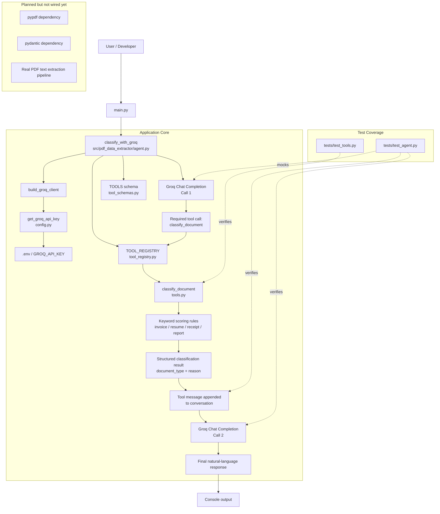

# pdf-data-extractor

A small Groq-powered agent that classifies documents (invoice, resume, receipt, report, or generic) using real LLM tool calling — not a prompt that just guesses in free text, but a model that has to call a Python function and get a structured answer back before it's allowed to respond.

## How it works

The classification logic itself is deliberately dumb and deterministic: `classify_document()` scores the document text against keyword lists per type and picks the winner. No LLM involved, no ambiguity, easy to test.

The interesting part is `classify_with_groq()`, which wraps that function as a tool the model must call:

1. Send the document to Groq (`llama-3.1-8b-instant`) with `tool_choice="required"` — the model has no choice but to call `classify_document`.
2. Parse the tool call, run the real Python function, and feed the result back into the conversation as a `tool` message.
3. Ask the model again, this time without forcing a tool call, so it can explain the classification in plain language.

This two-call round trip (call → run tool → call again) is the core pattern of the project, and it's what most of the test suite is built around — making sure the tool-call plumbing (message shapes, argument parsing, error handling) actually holds up, independent of what the model says.

## Project layout

```
main.py                              # entry point — classifies a hardcoded sample invoice
src/pdf_data_extractor/
  agent.py           # classify_with_groq() — the two-call Groq tool-calling flow
  tools.py           # classify_document() — the deterministic keyword classifier
  tool_registry.py   # maps tool name -> Python function
  tool_schemas.py    # JSON schema for the classify_document tool
  config.py          # loads GROQ_API_KEY from .env
tests/
  test_agent.py       # the Groq round trip, mocked
  test_tools.py        # the keyword classifier
```

## Architecture



## Running it

```bash
uv sync
# add GROQ_API_KEY (and GROQ_MODEL if you want to override the default) to a .env file at the repo root
uv run main.py
```

## Testing

```bash
uv run pytest
```

15 tests, all offline — the Groq client is mocked in `test_agent.py`, so nothing here needs a live API key to run.

## Status

`pypdf` and `pydantic` are already in the dependencies but not wired up yet — right now the pipeline classifies a hardcoded string in `main.py`. Actual PDF extraction (reading a file, pulling text out with `pypdf`, structuring the result with `pydantic`) is the next piece, not something that exists yet.
