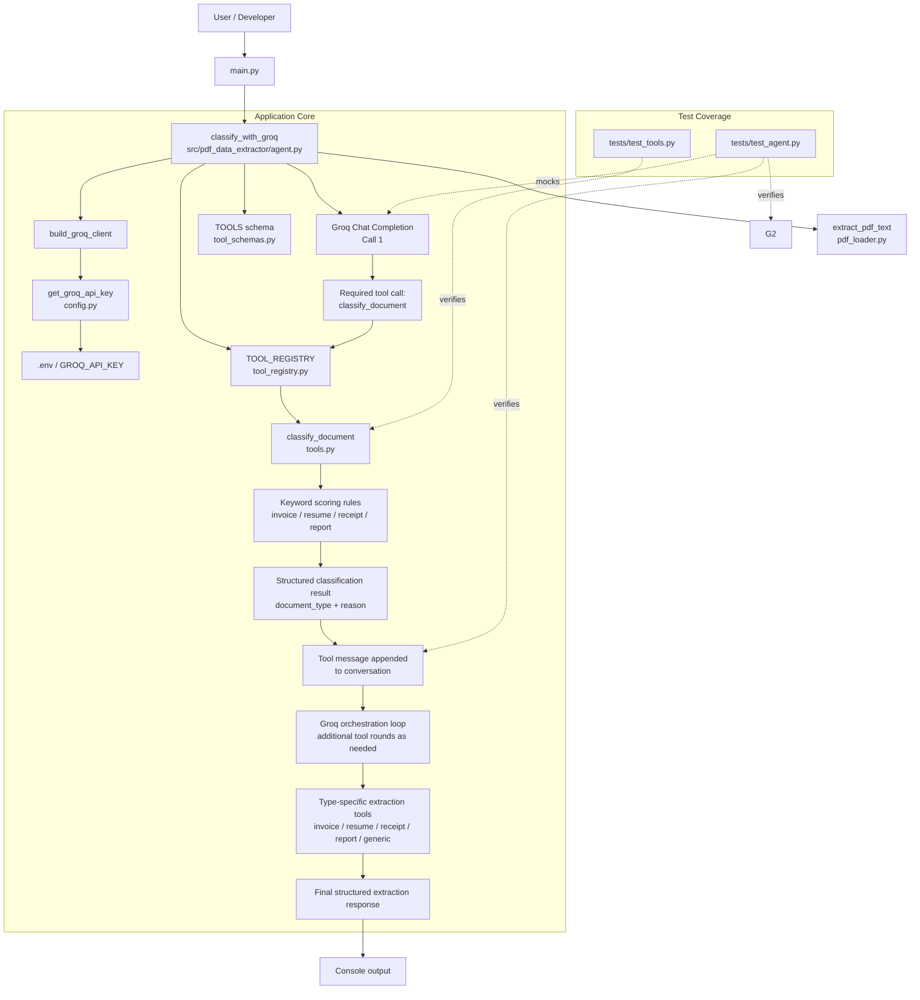

# pdf-data-extractor

A Groq-powered document extraction agent that first classifies a document as `invoice`, `resume`, `receipt`, `report`, or `generic`, then calls the matching extraction tool to return validated structured fields.

## How it works

The classification logic itself is deliberately deterministic: `classify_document()` scores the document text against keyword lists per type and picks the winner. No LLM involved, no ambiguity, easy to test.

The interesting part is `classify_with_groq()`, which wraps the classifier and extraction tools inside a small orchestration loop:

1. Send the document to Groq (`openai/gpt-oss-20b`) with `tool_choice` forcing `classify_document` on the first turn.
2. Parse each tool call, run the real Python function, and feed the result back into the conversation as a `tool` message.
3. Let the model choose the matching extraction tool for the classified type.
4. Keep calling the model with `tool_choice="auto"` until it stops asking for tools and returns the final structured result.

This supports flows like classify → extract → final response instead of assuming a fixed two-call round trip. The tests cover tool-call plumbing, argument parsing, schema validation, repeated tool execution, and loop termination.

## Project layout

```
main.py                              # entry point — analyzes a sample document
src/pdf_data_extractor/
  agent.py           # Groq tool orchestration loop
  tools.py           # deterministic classifier + extraction validators
  schemas.py         # pydantic models for extracted data
  tool_registry.py   # maps tool name -> Python function
  tool_schemas.py    # JSON schemas for classifier + extraction tools
  pdf_loader.py      # extracts text from PDF files
  config.py          # loads GROQ_API_KEY from .env
tests/
  test_agent.py      # mocked Groq orchestration tests
  test_tools.py      # classification and extraction validation tests
  test_pdf_loader.py # PDF text extraction tests
```

## Architecture



## Running it

```bash
uv sync
# add GROQ_API_KEY (and GROQ_MODEL if you want to override the default) to a .env file at the repo root
uv run main.py
```

## Testing

```bash
uv run pytest
```

42 tests, all offline. The Groq client is mocked in `test_agent.py`, so nothing here needs a live API key to run.

## Status

The project now supports:
- PDF text extraction through `pdf_loader.py`
- Deterministic classification into five document types
- Structured extraction for `invoice`, `resume`, `receipt`, `report`, and `generic`
- Pydantic validation for each extraction payload

The current sample entry point in `main.py` still uses a hardcoded example document, but the runtime path for real PDF text extraction is already implemented through `classify_pdf_with_groq()`.
