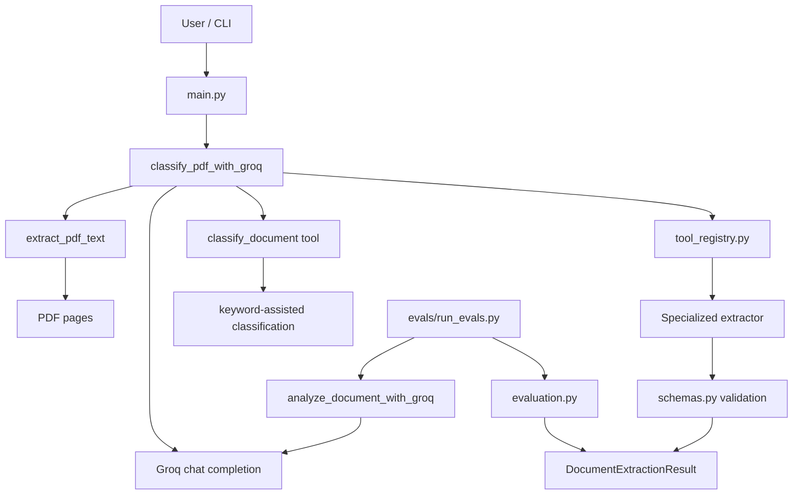

# pdf-data-extractor

[](https://github.com/E-techgod/pdf-data-extractor/actions/workflows/test.yml)

A Groq-powered document extraction agent for text-based PDFs. It extracts PDF text, classifies the document as `invoice`, `resume`, `receipt`, `report`, or `generic`, then routes the result through a schema-validated extraction tool for that document type.

## How it works

The runtime has two main layers:

1. `extract_pdf_text()` reads text from each PDF page and rejects missing files, directories, non-PDF inputs, and PDFs with no extractable text.
2. `classify_pdf_with_groq()` sends the extracted text to Groq, forces a first `classify_document` tool call, then forces exactly one specialized extraction tool based on the validated classification.

Classification is not delegated entirely to the model. The agent contains a deterministic keyword scorer in `src/pdf_data_extractor/agent.py` that can classify document text by keyword strength and falls back to `generic` when the signal is weak or tied. The extraction step is then validated with Pydantic models so each output shape stays constrained by document type.

## Project layout

```text
main.py
src/pdf_data_extractor/
  agent.py          # Groq orchestration, keyword scoring, tool-call execution
  config.py         # loads GROQ_API_KEY from .env
  evaluation.py     # completeness and field-accuracy scoring helpers
  main.py           # package CLI entrypoint used by `pdf-extractor`
  pdf_loader.py     # PDF text extraction
  schemas.py        # Pydantic models for classification and extraction payloads
  tool_registry.py  # document type -> extraction tool mapping
  tool_schemas.py   # Groq tool schemas
  tools.py          # schema-validated tool implementations
evals/
  golden_dataset.json  # labeled evaluation cases
  run_evals.py         # eval runner for text cases
tests/
  test_agent.py
  test_chaos_agent.py
  test_evaluations.py
  test_chaos_evaluations.py
  test_pdf_loader.py
  test_chaos_pdf_loader.py
  test_tools.py
  test_chaos_tools.py
  test_main.py
graphify-out/
  GRAPH_REPORT.md   # graph summary report
  graph.json        # graph data
  graph.html        # interactive graph view
```

## Architecture



## Running it

```bash
uv sync
```

Create a `.env` file at the repo root with:

```bash
GROQ_API_KEY=your_key_here
# optional override
GROQ_MODEL=llama-3.1-8b-instant
```

Run the root script against the default sample:

```bash
uv run main.py
```

Run it against a specific PDF:

```bash
uv run main.py data/receipt.pdf
```

Or use the packaged CLI entrypoint:

```bash
uv run pdf-extractor data/receipt.pdf
```

## Evaluation

The repo now includes a dataset-driven evaluation path in `evals/`. `run_evals.py` feeds labeled text cases through `analyze_document_with_groq()` and scores:

- classification correctness
- required-field completeness
- exact checked-field accuracy

Run it with:

```bash
uv run python evals/run_evals.py
```

## Tests

```bash
uv run pytest
```

Current collected suite: `125` tests.

The test coverage now spans:

- orchestration and tool-call enforcement
- schema validation for all extraction types
- PDF loading behavior
- evaluation metrics and nested-field matching
- adversarial and chaos cases for agent, tools, loader, and evaluation logic

## Graph artifacts

The generated architecture graph lives in `graphify-out/`:

- `GRAPH_REPORT.md` summarizes communities, hubs, and graph freshness
- `graph.json` stores the underlying graph data
- `graph.html` renders an interactive local network view

The current graph report dated `2026-08-03` describes a graph with `231` nodes, `625` edges, and `24` communities. It highlights `classify_with_groq()`, `DocumentExtractionResult`, `extract_pdf_text()`, and the evaluation helpers as central nodes in the codebase.

## Status

The current version supports:

- PDF text extraction from text-based PDFs
- deterministic keyword-assisted classification with `generic` fallback
- Groq-driven extraction for `invoice`, `resume`, `receipt`, `report`, and `generic`
- Pydantic validation for every extraction payload
- dataset-based evaluation utilities
- graph documentation outputs under `graphify-out/`
